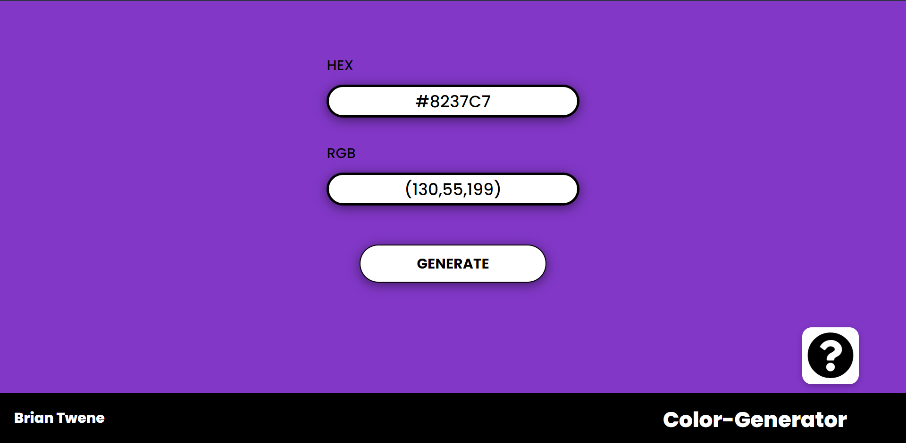

# Colour-Generator-Project
This project is a simple webpage that allows the user to generate a random colour by clicking a button.

## Motivation
I thought that this project would be great practice for my JavaScript skills in using DOM manipulation and using different layouts in CSS like grid and flexbox.

## Languages Used

**This project is built using:**
- HTML
- CSS
- And JavaScript

## Features

- Built with responsiveness in mind, works on smaller devices
- Displays Hexadecimal and RGB information on the color
- There is an about button that shows how to use the site

## How to use?

Simply click the "GENERATE" button and a random color will be generated the background (or panel on mobile). Colour information will be displayed in the RGB and HEX fields.

If you like the colour you can use `Ctrl+C` (`⌘ + C` on Mac) or right click and copy
 
## Future Plans
I plan on improving on this project in the future. 

**Some things I would like to do are:**
- Adding a copy to clipboard button
- Improving the JavaScript code 
- Adding accessibility and SEO practices in HTML code
- Adding indicators to buttons when a user hovers, clicks etc.

## Credits
This project was inspired by this [site](http://www.shodor.org/~ishaanr/PHP/colorgenerator.php?)
